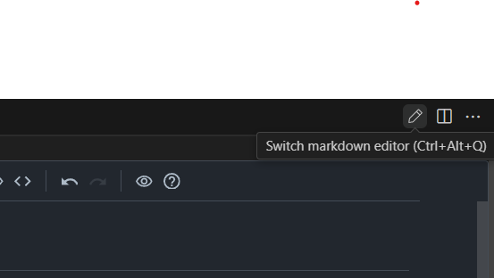

# issue信息

## issue链接

https://github.com/cweijan/vscode-office/issues/323

## 标题

[BUG] Shortcut for switching markdown editor doesn't work

## 标签

bug(报告者 DamianChybowski95Plus,创建于 2024-06-25,当前 open)

## 问题描述-原文

- OS: Windows
- Extension Version: 3.3.6

The button for this action works, but shortcut does not.

## 问题评论信息

1. DamianChybowski95Plus(报告者),2024-06-25:

   Here's a pull requrest for a solution that hopefully works; although i've not build vscode-office to test it
   https://github.com/cweijan/vscode-office/pull/324

   所附 [PR #324](https://github.com/cweijan/vscode-office/pull/324) "Adds missing keybinding":
   仅给 `office.markdown.switch` 增加无 when 的 `ctrl+alt+e` keybinding,已关闭未合并。

## 问题描述-中文

- 操作系统: Windows;扩展版本: 3.3.6;
- 「该操作的按钮可以工作,但快捷键不行」;
- 截图亲验(2026-10-07,见上图): VS Code 编辑器标题栏铅笔图标的悬停提示为
  **"Switch markdown editor (Ctrl+Alt+Q)"**——报告者环境中该命令的键位是 **ctrl+alt+q**,
  而非现在的默认键位 ctrl+alt+e;上游 package.json 历史从未默认绑定过 q,应为报告者自定义键位。

## 问题评论信息-中文

1. 报告者: 「这是一个希望能解决问题的 PR,不过我没有构建 vscode-office 来测试它」,附 PR #324 链接。

## 本仓库现状(分析补充)

该命令默认键位 `ctrl+alt+e`(mac: `ctrl+cmd+e`),keybinding when 条件 `editorTextFocus && editorLangId == markdown`;按钮菜单项 when 条件 `resourceExtname == '.md'`(不要求 editorTextFocus)。

## 期望行为

快捷键与标题栏按钮等效,均能切换 markdown 编辑器。

## 实际行为

(v3.3.6)点击按钮可正常切换编辑器;按快捷键无任何响应。

# 问题确认及解决

## 复现数据

复现文件: `test-workspace/markdown/test-markdown-cweijan-323-switch-editor-shortcut.md`
生成脚本: 文本文件,直接维护

文件内容说明: 极简 markdown(标题 + 段落 + 列表 + 代码块),作为被切换编辑器打开的操作对象。

### 复现步骤

1. 打开复现文件(以 Markdown Viewer/WYSIWYG 自定义编辑器方式打开);
2. 点击编辑器标题栏的切换图标("Switch markdown editor"):可正常切换,确认按钮通路正常;
3. 回到 Markdown Viewer,点击编辑区使焦点位于编辑器内,按 `ctrl+alt+e`(mac: `ctrl+cmd+e`);
4. 预期/实际(现行版本): 与按钮一样触发编辑器切回文本编辑器 ✅;
5. 对照: 以默认文本编辑器方式打开同一 md,焦点在文本编辑器内时按 `ctrl+alt+e`,切换到 Markdown Viewer ✅。

## 根因定位

已定位并经用户实测确认: **该 issue 已被上游后续版本解决,本仓库现行版本无需修复**。

### v3.3.6 时的状态(issue 报告时点)

1. `office.markdown.switch` 命令与标题栏按钮已存在(d5931f2,2024-03-05),但**宿主侧尚无任何 keybinding**(快捷键 5c1072d 直到 2024-07-15 才加入,晚于 issue);
2. webview 内部已有独立键盘监听(6179a6f,2024-03-04,当时位于 resource/vditor/util.js):`matchShortcut('^⌘e')||matchShortcut('^!e')` → `editInVSCode` → `openWith(uri, "default")`,但**只认 ctrl+alt+e 且只在焦点位于 webview 内时生效**;
3. 报告者使用自定义键位 ctrl+alt+q:按键未被 webview 拦截(不匹配 e)、冒回 workbench 触发用户自定义绑定(无 when 条件)→ `switchEditor` 执行,但焦点在 webview 时 `activeTextEditor` 为 undefined → `uri` 为 undefined → `vscode.openWith(undefined, 'default')` 无效([markdownService.ts:241-246](../../../src/service/markdownService.ts#L241-L246),此缺陷至今仍在);而按钮由 editor/title 菜单触发、VS Code 自动传入 uri,故正常——「按钮 works, shortcut does not」由此而来。

### 上游解决时间线

| 时间 | 提交 | 内容 |
|---|---|---|
| 2024-03-04 | 6179a6f | webview 绑定 ctrl+alt+e → editInVSCode(mac ctrl+cmd+e) |
| 2024-03-05 | d5931f2 | 加 `office.markdown.switch` 命令 + 标题栏按钮 |
| 2024-06-07 | 9443a8d (v3.3.6) | 发布,无宿主 keybinding,webview 绑定尚在 |
| 2024-06-25 | issue #323 + PR #324 | 报告者报障并提 PR(加无 when 的 ctrl+alt+e 绑定),PR 关闭未合并 |
| 2024-07-15 | 5c1072d | 上游自行加 keybinding: ctrl+alt+e,when `editorTextFocus && editorLangId == markdown`——解决文本编辑器场景 |
| 2024-09-28 | 378aab8 | "Fix edit in vscode shortcut not working."——webview keydown 重新加 matchShortcut 分支并 stopPropagation/preventDefault(此前某次重构曾把 6179a6f 的绑定弄丢),解决 webview 场景 |

现行版本两条通路齐备、场景互补:

- **焦点在文本编辑器**:宿主 keybinding(when 条件满足)触发,`activeTextEditor` 有值,uri 正常,切到 Markdown Viewer;
- **焦点在 Markdown Viewer(webview)**:[util.js:262-267](../../../resource/markdown/util.js#L262-L267) 的 `matchShortcut('^⌘e')||matchShortcut('^!e')` → `editInVSCode`(uri 来自 provider 闭包捕获,不依赖 activeTextEditor)→ 切回文本编辑器,并 stopPropagation 拦截按键冒泡。

### 本会话勘误记录

首次分析时只注意到宿主 keybinding 的 when 条件在 webview 场景不满足,漏查了 webview 内部快捷键通道,误判「现行版本快捷键在 webview 场景必然失效」并实施了 3 处改动(package.json when 扩展、Handler.uri 字段、switchEditor uri fallback);经用户在日常 VS Code(不含本地改动)实测——Markdown Viewer 打开、焦点在正文,ctrl+alt+e 可切回文本编辑器——推翻后已全部回滚(git checkout HEAD),并以 git 考证(6179a6f/5c1072d/378aab8/PR #324)补全上述时间线。

## 修复方案

**无需修复**(上游 5c1072d + 378aab8 已解决,本仓库 fork 基线包含两者)。

可选加固项(独立于本 issue,非必需):焦点在 webview 时经**自定义键位/命令面板**直接执行 `office.markdown.switch`,仍会因 `uri === undefined && activeTextEditor === undefined` 而无效;如需支持,可在 [markdownService.ts](../../../src/service/markdownService.ts) 的 `switchEditor` 增加 `getActiveMarkdownWebview()?.uri` fallback(需 Handler 暴露 uri 字段)。

## 验证方式

已于 2026-10-07 在日常 VS Code(发布版,不含任何本地改动)实测:

1. ✅ md 以 Markdown Viewer 打开、焦点在正文内,ctrl+alt+e 切回文本编辑器(webview 通道);
2. ✅ md 以文本编辑器打开、焦点在编辑器内,ctrl+alt+e 切到 Markdown Viewer(宿主 keybinding);
3. ✅ 标题栏按钮双向切换正常。

验证通过,可按 agent.md「完成归档」流程移入 done/。
