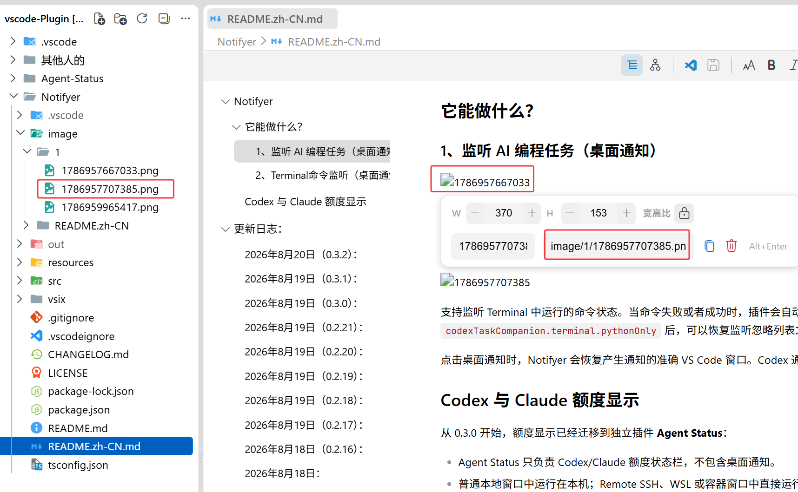

# issue信息

## issue链接

https://github.com/cweijan/vscode-office/issues/587

## 标题

[BUG]markdown 的照片突然不显示了，原来的版本可以正常显示

## 标签

bug(报告者 mapengsen,创建于 2026-08-20,当前 open)

## 问题描述-原文

- OS:
- Extension Version:


## 问题评论信息

1. cweijan(仓库维护者),2026-08-20: 图片路径是什么

2. mapengsen(报告者),2026-08-20:

   image/1/1786957707385.png

   

3. cweijan(仓库维护者),2026-08-20:

   应该是你启用了vscode-office.workspacePathAsImageBasePath, 这个会将所有图片路径根路径都改为工作空间路径, 如果其他文件夹有这个需求, 你可以使用工作级别的设置, 防止全局生效

## 问题描述-中文

- 操作系统与扩展版本均未填写(issue 模板留空);
- 正文无文字描述,仅附一张截图: markdown 文档渲染后,照片位置不显示图像;
- 截图亲验(2026-10-07,见上图): 文档为白底编号列表,可见两个条目
  「**1、监听 AI 编程任务(桌面通知)**」(条目下为碎图占位符,占位符下有说明文字
  「支持监听 Codex、Claude Code 等 AI Agent 的主任务状态。当任务…」,右侧截断)与
  「**2、Terminal命令监听(桌面通知)**」(条目下同为碎图占位符,其后截断);
  两处图片均显示为破损图标 + 时间戳形式文字 **1786957667033**、**1786957707385**;
- 结合标题: markdown 中的照片在某次扩展升级后突然不显示,回退到原来的版本可以正常显示,属版本回归。

## 问题评论信息-中文

1. 维护者: 「图片路径是什么」。

2. 报告者: `image/1/1786957707385.png`,并附第二张截图(亲验见下)。

3. 维护者: 「应该是你启用了 `vscode-office.workspacePathAsImageBasePath`,这个会将所有图片
   路径的根路径都改为工作空间路径;如果其他文件夹有这个需求,你可以使用工作区级别的设置,
   防止全局生效」。

第二张截图亲验(2026-10-07,见评论 2 原文处): VS Code 窗口,左侧资源管理器工作区为多项目
父目录(名称显示为 `vscode-Plugin …`,含 `.vscode`、`其他人的`、`Agent-Status`、`Notifier`、
`out`、`resources`、`src`、`vsix` 等子项);当前打开并选中的是 `Notifier/README.zh-CN.md`
(面包屑 `Notifier > README.zh-CN.md`);`Notifier/image/1/` 下可见 `1786957667033.png`、
`1786957707385.png`(红框标注)、`1786959965417.png`——图片文件实际存在;右侧渲染预览即正文
截图的同一文档,两处图片均为破图占位(`1786957667033`、`1786957707385`),预览区悬浮图片控件
(宽高输入框 W 370 / H 153、宽高比锁、复制/删除、`Alt+Enter`)中显示图片路径
`image/1/1786957707385.png`(红框标注)——报告者以此回答维护者「图片路径是什么」的提问。

## 补充归纳(非原文)

以下为本仓库分析归纳,非 issue 原文(评论信息于 2026-10-07 经 GitHub API 逐字还原补全):

- 「原来的版本可以正常显示」表明报告者认为是版本回归,但其未填写版本号,升级前后版本未知;
- 综合正文与评论 2 的截图: 工作区为多项目父目录(名称显示为 `vscode-Plugin …`,含
  `其他人的`、`Agent-Status`、`Notifier` 等子文件夹),md 位于 `Notifier/README.zh-CN.md`,
  图片引用为相对路径 `image/1/<毫秒时间戳>.png`,图片文件实际存在于 `Notifier/image/1/` 下
  (时间戳 1786957667033/1786957707385 ≈ 2026-08-17,与本扩展粘贴图片的 `${now}` 命名风格一致,
  但规则来源无法确证);
- 「不显示」的具体形态经亲验为碎图占位符(破损图标 + 时间戳文字),非空白;两截图中渲染预览
  均为同一文档(`Notifier` 的 README 中文版,大纲含「更新日志: 2026年8月20日(0.3.2)…」);
- 维护者定性(评论 3): 用户启用了 `vscode-office.workspacePathAsImageBasePath`
  (该配置现行 [package.json](../../../package.json) 仍存在,开启后图片 base 改取工作区路径,
  见 [markdownEditorProvider.ts:366](../../../src/provider/markdownEditorProvider.ts#L366)),
  相对路径 `image/1/...` 按工作区根而非 `Notifier/` 解析 → 落空 → 不显示;建议有需要的文件夹
  改用工作区级设置 —— 该定性已于 2026-10-07 经代码复核**确认成立**(见「问题确认及解决」;
  原 `3e17862` 回归推断与本案相对路径场景不符,已在根因定位中勘误撤销);
- 两张原截图托管于 GitHub 用户附件服务(user-attachments 资产,渲染层经 private-user-images
  短时效 JWT 中转),本次更新时已分别抓取归档至
  `docs/plans/images/plan-cweijan-issues-587-local-image-regression-1791365284.png`(正文)与
  `...-1791366975.png`(评论 2)。

## 期望行为

升级后的扩展版本仍应与旧版本一致,正常渲染 markdown 中的本地照片(推断;正文未明写,
按「原来的版本可以正常显示」反推)。

## 实际行为

markdown 中的照片不显示: 截图亲验为碎图占位符(破损图标 + 时间戳形式文字);
据后续评论,图片引用为相对路径 `image/1/<时间戳>.png` 且文件实际存在于 md 所在目录下。
经代码复核(见「问题确认及解决」),维护者定性成立: 系 `workspacePathAsImageBasePath`
配置开启后相对路径按工作区根解析所致,非扩展版本回归。

# 问题确认及解决

## 复现数据

复现文件: `test-workspace/markdown/test-markdown-cweijan-587-local-image-regression.md`
生成脚本: 文本文件,直接维护

文件内容说明: 构造本地相对路径图片引用三处(PNG/JPG/GIF,均指向 `test-workspace/image/`
下真实存在的文件)。复现时需将其放入「多项目父目录工作区」的某个子项目中(见复现步骤),
以还原 issue 的工作区布局。

### 复现步骤

1. 构造工作区(任意位置,如 `%TEMP%/issue-587/`):

   ```
   issue-587/                <- VS Code 打开的工作区(父目录)
   ├── Notifier/             <- 任意子项目名
   │   ├── README.zh-CN.md   <- 复制复现文件内容,图片引用改为指向本项目内真实图片
   │   └── image/1/x.png     <- 放一张真实图片(引用形态 `image/1/x.png`,与 issue 一致)
   └── Other-Project/        <- 再放一个项目,匹配「多项目共父目录」场景
   ```

2. 用户级设置开启 `vscode-office.workspacePathAsImageBasePath`(对应 issue 用户状态);
3. F5 调起扩展调试,「打开文件夹」选中 `issue-587` 父目录,打开 `Notifier/README.zh-CN.md`;
4. 预期(按配置语义): 相对路径按工作区根 `issue-587/` 解析 → `issue-587/image/1/x.png`
   不存在 → 碎图占位(与 issue 截图现象一致);
5. 关闭该配置(用户级)重新打开: 相对路径按 md 所在目录解析 → `Notifier/image/1/x.png`
   存在 → 正常显示——复现闭合,确认配置为因;
6. 对照(维护者建议的 workaround): 配置仅在该**工作区级别**关闭(工作区设置),
   用户级保持开启,验证本工作区恢复正常且其他工作区不受影响;
7. 反证「原来正常」: 「打开文件夹」改为直接打开 `Notifier`(单项目工作区),保持配置开启
   → 工作区根 = `Notifier/` → 图片正常显示——说明「原来的版本可以正常显示」更可能源于
   当时的工作区布局(单项目打开),而非扩展版本。

## 根因定位

**已确认(代码实锤 + 维护者定性复核成立): 配置语义与用户路径风格错配,非扩展版本回归。**

### 1. 生效链路(代码实锤)

- [markdownEditorProvider.ts:366-368](../../../src/provider/markdownEditorProvider.ts#L366-L368):

  ```ts
  const basePath = Global.getConfig('workspacePathAsImageBasePath') ?
      vscode.Uri.file(getWorkspacePath(folderPath)) : folderPath;
  ```

  配置关闭时 basePath = md 所在目录(folderPath);开启时 = `getWorkspacePath()` 结果;
- [getWorkspacePath](../../../src/common/fileUtil.ts#L49-L61): 单 folder 工作区返回
  `folders[0]`(即所打开的父目录根),多 folder 时返回包含该 uri 的 folder;
- basePath 经 `asWebviewUri` 后注入 webview HTML 的 `<base href>`,md 内相对路径图片
  一律相对该 base 解析;
- 用户场景(据评论与截图亲验): 工作区 = 多项目父目录,md 在 `Notifier/`、图在
  `Notifier/image/1/`、引用 `image/1/x.png`(相对 md 所在目录)。开启配置 → base 上移到
  父目录根 → 解析为 `{父目录}/image/1/x.png` → 文件不存在 → 碎图(破损图标 + alt 时间戳文字);
- 该配置语义([package.json:707-711](../../../package.json#L707-L711),「以工作区路径作为
  Markdown 图片的基础路径」)期望用户的图片引用以**工作区根**为基准书写
  (如 `Notifier/image/1/x.png`),与该用户「相对 md 所在目录」的存量路径风格错配。

### 2. 「原来的版本可以正常显示」的来源(推断,验证见复现步骤 7)

- 该配置与 baseUrl 三元逻辑自 2023-01-12(`02c3042`)引入后**从未改动**
  (git `-S` 全历史仅 `0ee4916` 的 i18n 描述触及,不动逻辑),「扩展升级导致回归」不成立;
- 最合理解释: 用户此前以**单项目工作区**打开(工作区根恰为 `Notifier/`,相对路径按根解析
  也能命中 `Notifier/image/1/`),后改为**多项目父目录**打开 → base 上移一级 → 落空;
  变化的是工作区布局,被用户归因为版本升级;
- 与维护者「改用工作区级设置,防止全局生效」的建议互证: 维护者同样认定是配置作用域问题。

### 3. 历史推断勘误(保留考证记录)

本 plan 首版(评论尚未还原时)曾推断根因为 `3e17862`(2026-06-28,v4.0.7)移除
`viewAbsoluteLocal`/imageParser 导致 `file:///` 绝对路径图片失去支持。经评论信息还原
(用户引用为相对路径且文件实际存在)复核: **该推断与本案场景不符,予以撤销**。其考证价值
转移: `3e17862` 移除造成的 `file:///` 显示空洞仍真实存在,归入
[plan-cweijan-issues-405](plan-cweijan-issues-405-image-placeholder.md) 的可选补强项
(该 issue 的 `/` 开头工作区绝对路径缺口已由 `e0c132b` 补上)。首版同时完成的
「4.1.7 两个图片提交(`e0c132b`/`116c3b7`)非回归源」的排除结论依然成立,不再赘述。

## 修复方案

**本 issue 无需代码修复**(配置语义如此,用户侧解法维护者已在评论给出: 关闭配置或改用
工作区级设置)。可选改进(低优先级,均不在本次实施):

1. **配置描述增强**(零风险): [package.json](../../../package.json) 的
   `workspacePathAsImageBasePath` description 补充后果说明,如「开启后 markdown 内相对路径
   将按工作区根而非文件所在目录解析;多项目父目录工作区下,相对 md 所在目录的引用将无法
   显示」,并同步全部 nls 文案;
2. **加载失败兜底**(待议,可能引入歧义): webview 侧对加载失败的相对路径 img 回退
   md 所在目录 base 重试一次,需宿主在 `open` 消息中增发 folderPath 的 asWebviewUri 前缀;
   同名误加载风险需先评估,不建议贸然实施。

## 验证方式

按「复现步骤」逐条:

1. 步骤 4: 配置开启 + 父目录工作区 → 碎图(issue 现象复现);
2. 步骤 5: 关闭配置 → 正常显示(确认配置为因);
3. 步骤 6: 工作区级关闭 → 本工作区正常、其他工作区不受影响(维护者 workaround 验证);
4. 步骤 7: 单项目工作区 + 配置开启 → 正常(「原来正常」来源的反证);
5. 回归项(若实施可选改进 1): 各语言配置描述与实际行为一致;改进 2 实施时另补
   重名文件场景的误加载评估记录。

验证通过后按 agent.md「完成归档」流程移入 done/。
