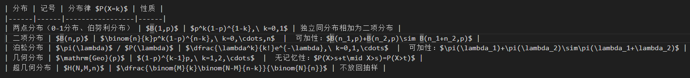
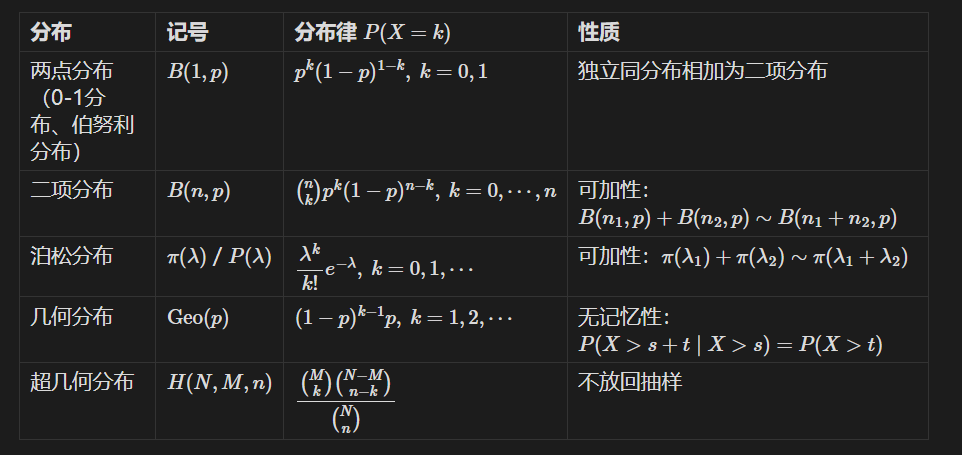

# issue信息

## issue链接

https://github.com/cweijan/vscode-office/issues/598

## 标题

[BUG] 表格和数学公式结合导致渲染错误

## 标签

bug(报告者 tyler55427,创建于 2026-09-03,当前 open)

## 问题描述-原文

- OS: window
- Extension Version: 4.2.0

md源码：  

插件渲染结果：  

obsidian渲染结果：  

疑似左右相邻的表格中都存在数学公式，导致表格间隔符号被识别为数学公式

## 问题评论信息

无评论

## 问题描述-中文

- 操作系统: window(原文如此,应为 Windows);扩展版本: 4.2.0;
- 报告人依次贴出三张截图:md 源码、插件渲染结果(错误)、obsidian 渲染结果(对照);
- 「疑似左右相邻的表格中都存在数学公式,导致表格间隔符号被识别为数学公式」。

截图亲验(2026-10-07,已归档上图):

1. **md 源码截图**:一个 4 列表格「分布 | 记号 | 分布律 $P(X=k)$ | 性质」,5 个数据行——两点分布、二项分布、泊松分布、几何分布、超几何分布;多数单元格含单 `$` 定界的行内公式,如 `$\binom{n}{k}p^k(1-p)^{n-k},\ k=0,\cdots,n$`、「可加性：$B(n_1,p)+B(n_2,p)\sim B(n_1+n_2,p)$」、「无记忆性：$P(X>s+t\mid X>s)=P(X>t)$」;`|` 两侧各一空格,无 `\|` 转义;
2. **插件渲染结果截图**(错误表现):KaTeX 公式本身渲染正常,但「二项分布/泊松分布/几何分布」行中第 3、4 列之间的 `|` 不再充当单元格分隔符——「可加性：」「无记忆性：」等文字与后续公式被并入第 3 列,单元格内出现以纯文本显示的裸 `|`(泊松、几何行公式后直接跟 `|`),第 4 列变空或只剩孤立 `|`(二项分布行);右侧相邻单元格为纯文本的行(两点分布、超几何分布)渲染完全正常;表格行间无横线、底部无闭合边框,呈「半渲染」观感;
3. **obsidian 渲染结果截图**(正确对照):同一源码渲染为边框完整的 4 列表格,「可加性」「无记忆性」及各公式均位于「性质」列原位,无裸竖线、无空单元格、无错位。

## 问题评论信息-中文

无

## 补充归纳(非原文)

(本仓库归纳,非 issue 原文:)

- 报告人正文末行的原因推测属原文(见上);「分隔符 `|` 被并入公式」为其对表象的描述,机理层面的分析见下方「问题确认及解决」;
- issue 无评论,维护者尚未回复。

## 期望行为

表格单元格内的行内公式 `$...$` 正常经 KaTeX 渲染,表格结构与分隔符完好,
渲染结果与 Obsidian 一致(推断;正文以 Obsidian 截图作为正确对照)。

## 实际行为

相邻单元格含公式时表格渲染错误: 分隔符 `|` 不再被识别为单元格边界,以纯文本形式留在单元格内,表格结构错乱(见 issue 截图)。

# 问题确认及解决

## 复现数据

复现文件: `test-workspace/markdown/test-markdown-cweijan-598-table-math-formula.md`
生成脚本: 文本文件,直接维护

文件内容说明: 构造一个多行多列、大量单元格含 `$...$` 行内公式的表格(公式列左右相邻,
最大化触发「分隔符被识别为公式」的场景),并附三个对照: 同构但不含公式的表格、
单元格内双公式(`$a$ 与 $b$`)、表外独立 `$$...$$` 块级公式,
用于区分「表格内公式」与「公式本身」各自是否正常。

### 复现步骤

1. F5 调起扩展调试,打开复现文件;
2. 查看含公式表格的渲染结果,并与三个对照组比较;
3. 预期: 表格结构完整、单元格内公式正常渲染(与 Obsidian 一致);
   实际: 分隔符被吞入公式、表格错乱(issue 现象)。

## 根因定位

**部分定位(症状机理已确认;当前仓库代码无法复现,缺陷锁定在 lute 打包产物层,附排除项与推断)**。

**症状核实(已取得 issue 三张原图并逐字符核对)**:仅当**同一行中左右相邻的两个单元格都含 `$...$` 行内公式**时,两单元格间的 `|` 不被识别为单元格分隔符——两列合并为一个单元格(内容为「公式A + 纯文本 `| 可加性：` + 公式B」),行尾列变空;右单元格为纯文本的行(两点分布、超几何分布)渲染完全正常。公式本身 KaTeX 渲染正确,`|` 以纯文本形式出现而非公式内容——即报告人「分隔符被识别为数学公式」是对表象的描述,实质是**该 `|` 被解析器跳过、未参与单元格切分**。这是典型的「表格行按 `|` 切分 vs 行内公式 span 配对」相互作用问题,发生在解析器(lute)内部。

**排除项(逐层实测,均用仓库内置 [lute.min.js](../../../resource/markdown/dist/js/lute/lute.min.js) 在 node 直驱验证)**:

- lute 层(嫌疑最大,但当前版本四个入口全部正确):用按 issue 原图逐字符重建的表格(含 `\binom`、`\pi`、`\dfrac`、`\ ` 反斜杠空格、`\mid`、全角冒号、ASCII `|` 两侧各一空格、单 `$` 定界、无 `\|` 转义)实测 `Md2VditorDOM`(wysiwyg 打开路径,含 `SetVditorWYSIWYG(true)` 及 setLute 全套产品默认参数)、`Md2VditorIRDOM`(IR 模式)、`VditorDOM2Md`(保存回写往返)、`SpinVditorDOM`(编辑态再解析)——**每行均为 4 个单元格、`|` 不入公式、反斜杠完整保留**;另测了 ZWSP/NBSP 贴近 `|` 或 `$`、`$$` 定界、公式内裸 `|`(`$P(A|B)$`)、无空格管道等变体,均不触发合并(仅 `$$x$$` 会被当作 `$`+`$x$`+`$`,与本 issue 症状不符);
- vditor TS 层无跨单元格正则:KaTeX 渲染逐 `.language-math` 元素进行、取码用 textContent([mathRender.ts:26-83](../../../vditor/src/ts/markdown/mathRender.ts#L26-L83)、[adapterRender.ts:1-4](../../../vditor/src/ts/markdown/adapterRender.ts#L1-L4));行内公式 CodeMirror 后处理逐 span([inlineMathCodeMirror.ts](../../../vditor/src/ts/math/inlineMathCodeMirror.ts));`processCodeRender`/`syncMathBlocksDisplayMode` 亦为逐元素([processCode.ts:171-213](../../../vditor/src/ts/util/processCode.ts#L171-L213))——均不可能吞掉单元格间的 `|`;
- 宿主侧:打开链路只透传文件原文,无 markdown 预处理。

**推断**:缺陷位于 lute(Go 实现经 GopherJS 打包为 `lute.min.js`,仓库无其源码)的表格行切分逻辑——当行内公式 span 的配对/区间计算覆盖到相邻单元格间的 `|` 时,该分隔符被跳过,两个含公式的单元格被并入同一 cell;「左右相邻单元格同时含 `$...$`」正是 `|` 落入公式区间的必要条件,与症状完全自洽(单侧公式时 `|` 不落入任何区间,切分正常)。当前仓库无法复现的原因待查:版本事实是 [vditor/src/js/lute/lute.min.js](../../../vditor/src/js/lute/lute.min.js) 自 v4.1.0(2026-07-01,经 f7321e5 "Up lute"、116f4cc "Fix lute inlineDigit bug" 等升级)后未再变动,与 4.2.0 报告版本同源,且 `resource/markdown/dist/` 为构建产物不入库、随 vite 重建——报告人所用 4.2.0 安装包内的 lute 构建是否与当前源码一致已不可考(4.2.0 vsix 无处下载);另一可能是原始文件含截图与 OCR 均不可见的字符。**故下一步必须以当前构建做真机验证(见修复方案步骤 1),再决定是否需要代码修复。**

## 修复方案

分两步走(先验证再决策,不直接动代码):

1. **当前构建真机验证(第一步,决定走向)**:按「复现步骤」F5 打开 `test-workspace/markdown/test-markdown-cweijan-598-table-math-formula.md`(真实 webview + 当前 dist 产物,可覆盖 node 模拟与浏览器执行的差异;同时在 IR 与 wysiwyg 两种 editMode 下各看一遍):
   - 若渲染正确 → 本 issue 在当前版本已不可复现:在 issues.xlsx 标注「当前版本无法复现」,并回复上游 issue 请报告人提供原始 md 文件(或确认所用 4.2.0 具体构建),归档本 plan;
   - 若仍错乱 → 执行步骤 2;
2. **确认仍可复现时的两处修复点**:
   - **升级 lute(首选)**:取 siyuan-note/lute 最新构建替换 [vditor/src/js/lute/lute.min.js](../../../vditor/src/js/lute/lute.min.js)(仓库历史两次 lute 升级均针对同类 math 解析问题,是既定先例),替换后用本 plan 的复现文件 + node 四入口回归;
   - **或 vditor 侧预处理兜底(次选)**:在 `Md2VditorDOM` 调用入口([renderDomByMd.ts:24](../../../vditor/src/ts/wysiwyg/renderDomByMd.ts#L24)、[EditMode.ts:77](../../../vditor/src/ts/toolbar/EditMode.ts#L77) 等)之前,对「确认是表格行的行」中位于**成对 `$...$` 区间内**的未转义 `|` 转义为 `\|`;并在保存链 `VditorDOM2Md` 输出后校验各行列数与表头一致,不一致时输出告警日志,防止写坏文件。

## 验证方式

对应「复现步骤」:

1-2. F5 打开复现文件,重点检查「公式相邻列」的表格:预期(修复/确认不可复现后)表格 4 列结构完整、单元格内公式正常经 KaTeX 渲染、所有 `|` 仅作为列分隔符出现而非正文文本,渲染结果与 issue 中 Obsidian 截图一致;三个对照组(同构无公式表、单元格内双公式 `$a$ 与 $b$`、表外独立 `$$` 块)行为不回退;
3. 若实施修复方案 2,额外回归:
   - `\mid` 条件概率公式(公式内含 `|` 语义字符,如 `$P(X>s+t\mid X>s)$`)、公式内裸竖线 `$P(A|B)$`、`\|` 转义写法——三者渲染与往返序列化均不重复转义;
   - 含公式的**表头行**、表格前后普通段落中的公式、编辑态在公式单元格内输入(SpinVditorDOM 链路)、保存后关闭重开(VditorDOM2Md 往返不损坏文件);
   - IR / wysiwyg 双模式切换后渲染一致。
