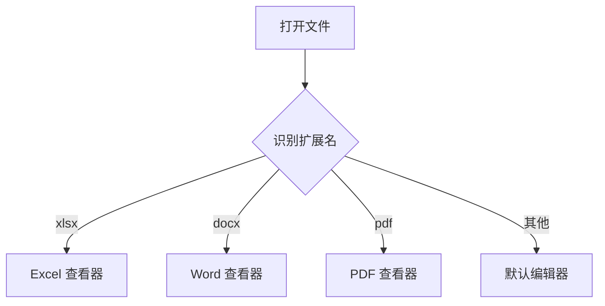
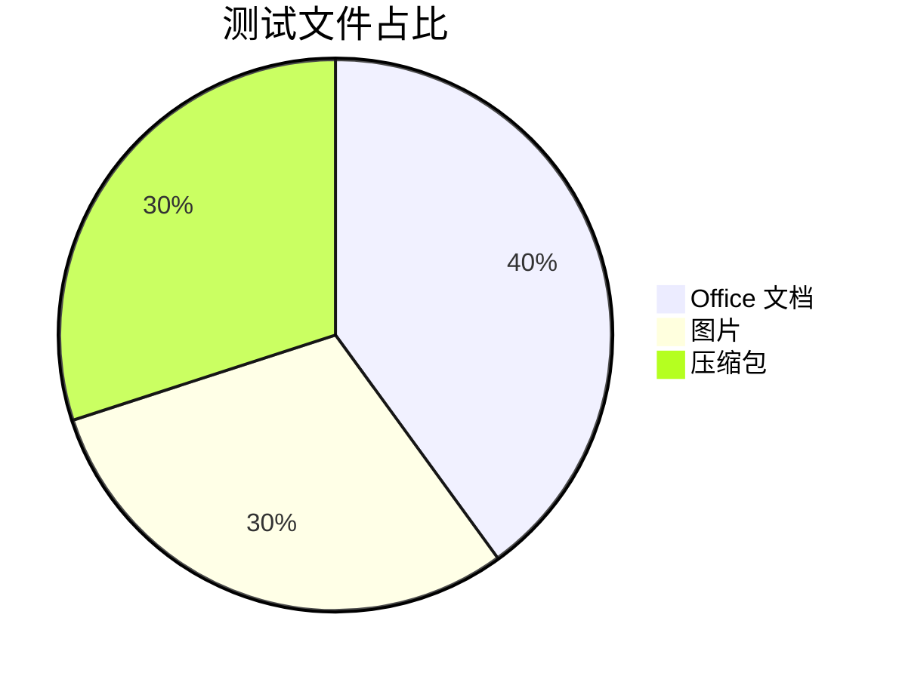

# Office Viewer Markdown 测试文档

用于测试 vditor 所见即所得编辑器的完整语法渲染。

## 1. 文本样式

**粗体文本**、*斜体文本*、***粗斜体***、~~删除线~~、`行内代码`、[超链接](https://code.visualstudio.com/)。

中英文混排 Mixed 中英文 typesetting 测试，包含特殊字符：<>&"' 以及 HTML 实体 &amp;。

## 2. 列表

无序列表：

- 项目一
- 项目二
  - 嵌套项目 2.1
  - 嵌套项目 2.2
- 项目三

有序列表：

1. 第一步
2. 第二步
3. 第三步

任务列表：

- [x] 已完成事项
- [ ] 待办事项
- [ ] 另一个待办

## 3. 引用与分割线

> 这是一段引用。
>
> > 引用可以嵌套。

---

## 4. 表格

| 格式 | 路由 | 说明 |
| :--- | :---: | ---: |
| xlsx | excel | Excel 工作簿 |
| docx | word | Word 文档 |
| pptx | ppt | PowerPoint |
| epub | epub | 电子书 |

## 5. 代码块

```typescript
interface Viewer {
  route: string;
  open(uri: Uri): Promise<void>;
}

const viewer: Viewer = {
  route: 'excel',
  async open(uri: Uri) {
    console.log(`opening ${uri.fsPath}`);
  },
};
```

```python
def fibonacci(n: int) -> list[int]:
    seq = [0, 1]
    while len(seq) < n:
        seq.append(seq[-1] + seq[-2])
    return seq[:n]
```

```sql
SELECT month, sales FROM monthly_sales WHERE sales > 1000 ORDER BY sales DESC;
```

## 6. 数学公式 (KaTeX)

行内公式：$E = mc^2$

块级公式：

$$
\int_{-\infty}^{\infty} e^{-x^2} \, dx = \sqrt{\pi}
$$

$$
\sum_{i=1}^{n} i = \frac{n(n+1)}{2}
$$

## 7. Mermaid 图表





## 8. 图片

相对路径图片：


动态 GIF：


## 9. 脚注与其他

这是一个脚注引用[^1]。

[^1]: 脚注内容：vditor 支持脚注语法。

- Emoji: :smile: :rocket: :tada:
- 自动链接：<https://github.com>
- 转义：\*不是斜体\*
